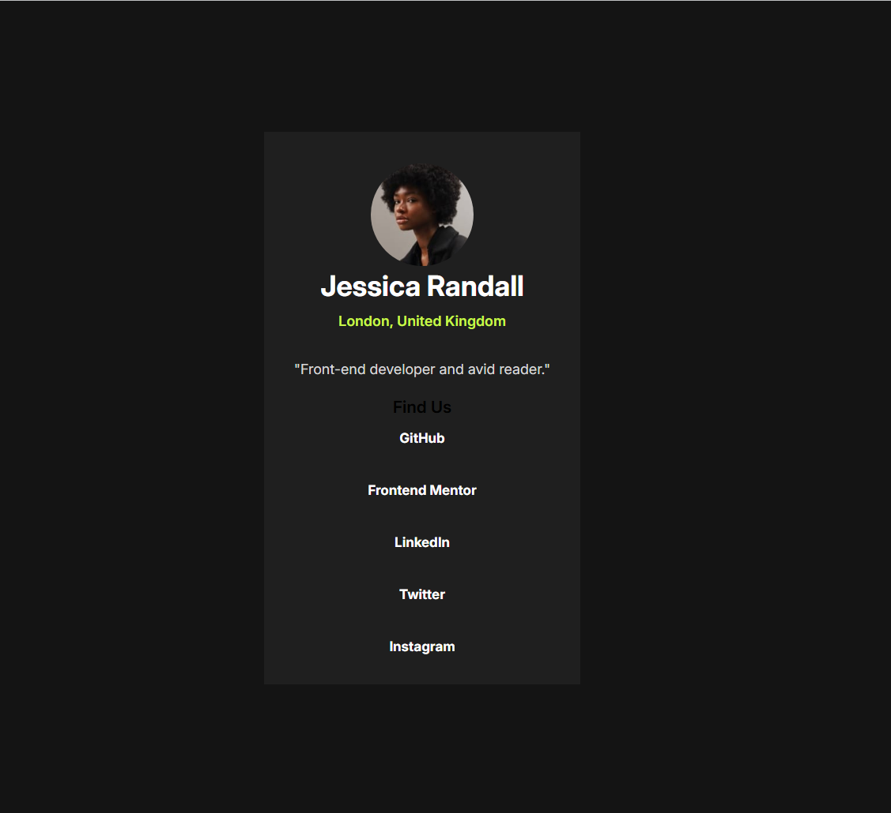

# Frontend Mentor - Product preview card component solution

This is a solution to the [Product preview card component challenge on Frontend Mentor](https://www.frontendmentor.io/challenges/product-preview-card-component-GO7UmttRfa). Frontend Mentor challenges help you improve your coding skills by building realistic projects. 

## Overview

### Screenshot

### Links

- Solution URL: (https://www.frontendmentor.io/challenges/product-preview-card-component-GO7UmttRfa)
- Live Site URL: ((https://social-links-in-profile.netlify.app)

### Built with

- Semantic HTML5 markup
- CSS custom properties
- Flexbox

## Author

- Frontend Mentor - [@DeveloperTaskin](https://www.frontendmentor.io/profile/yourusername)
- Github - [developerTaskin](https://github.com/developertaskin)
